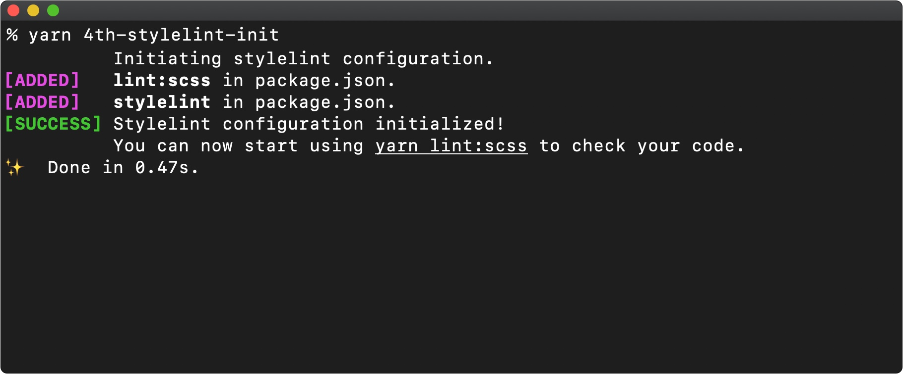

# @4th/stylelint-config
> An easy to set up stylelint configuration that can be shared between your projects.

![Version][version-image]
![License][license-image]

With this configuration, you can ensure that all developers on your team adhere to the coding standards for `scss`, `less` and `css` files. Changes can be made at any time - old configurations are automatically overwritten, since there is only one source of truth.

<br>



<br>

## Installation

Add this package as a devDependency to your project:

```
yarn add --dev @4th/stylelint-config
```

Optionally you can add [@4th/git-hooks][git-hooks] if you want to auto-lint upon committing:

```
yarn add --dev @4th/git-hooks
```

<br>

## Usage

Once the `@4th/stylelint-config` package is installed, you can initiate it with:

```
yarn 4th-stylelint-init
```

_Note that any optional stuff (e.g. `@4th/git-hooks`) must be present before this script is executed. In case you need to run the configuration again, you can use the flag **--force** to run the configuration process again and overwrite all settings._

<br>

## Behind the scenes

The initialization process extends the _package.json_ file as follows:

```json
{
  "scripts": {
    "lint:scss": "4th-stylelint . --color --fix"
  },
  "stylelint": {
    "extends": [
      "@4th/stylelint-config"
    ]
  }
}
```

If you have [@4th/git-hooks][git-hooks] as a devDependency, the _package.json_ file will be extended even further:

```json
{
  "scripts": {
    "lint:scss:staged": "git diff --diff-filter=ACMRT --cached --name-only '*.scss' | xargs 4th-stylelint"
  },
  "git": {
    "pre-commit": "lint:scss:staged"
  }
}
```

<br>

## Customize to your needs

You can edit the files that define the coding standards as needed. You can also rename this project to `@company/stylelint-config` to tailor it to your cooporate. To change the name of the initialization process, you must modify the fields within `bin` in the _package.json_ file as follows:

```json
{
  "bin": {
    "company-stylelint": "./bin/stylelint.sh",
    "company-stylelint-init": "./init.js"
  },
}
```

<br>

## Further documents
- [Changelog](/docs/changelog.md)
- [Contributing](/docs/contributing.md)
- [Pull request](/docs/pull_request.md)
- [Code of conduct](/docs/code_of_conduct.md)

<br>

## Related projects

@4th/git-hooks | @4th/eslint-config
:-------------------------|:-------------------------
[![@4th/git-hooks][git-hooks-image]][git-hooks] | [![@4th/eslint-config][eslint-image]][eslint-config]

<br>

## License

Copyright © 2020 by 4th motion GmbH. Released under the [MIT License][license].

[version-image]: https://img.shields.io/github/package-json/v/4th-motion/stylelint-config
[license-image]: https://img.shields.io/github/license/4th-motion/stylelint-config
[git-hooks-image]: https://avatars1.githubusercontent.com/u/8463894?s=200&v=4
[eslint-image]: https://avatars3.githubusercontent.com/u/6019716?s=200&v=4
[git-hooks]: https://github.com/4th-motion/git-hooks
[eslint-config]: https://github.com/4th-motion/eslint-config
[.editorconfig]: .editorconfig
[.prettierrc.js]: .prettierrc.js
[license]: LICENSE.md
